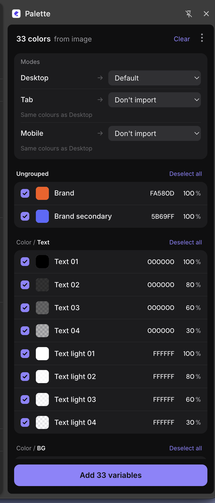
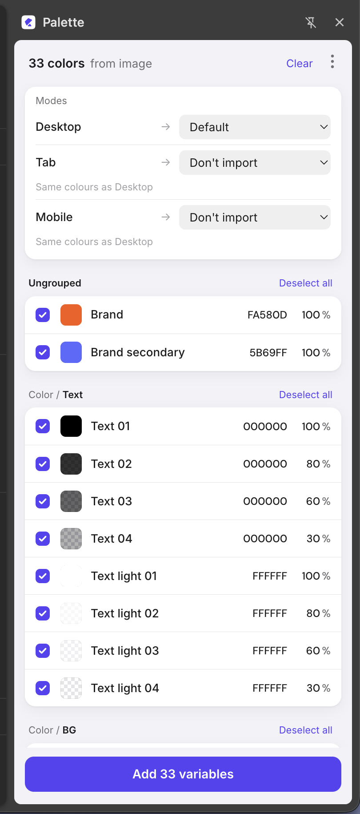
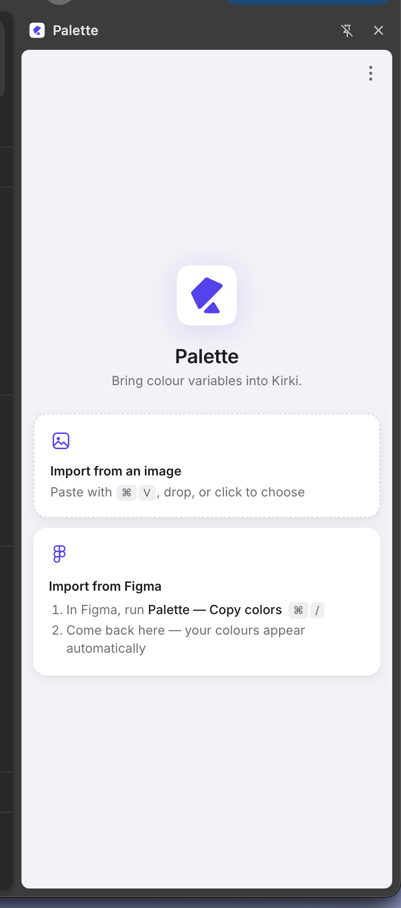
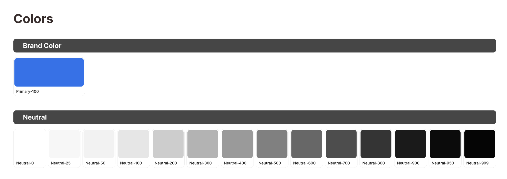

# Palette


Bring colour variables into **Kirki** — from **Figma** or from an **image of a colour chart** — with names, opacity and modes.

Palette is two small pieces that work together:

| Piece | Folder | What it does |
|---|---|---|
| Chrome extension (MV3 side panel) | [`extension/`](extension) | Reads colours (from the clipboard or an image), lets you review them, and writes them into Kirki's Variables. |
| Figma plugin | [`figma-plugin/`](figma-plugin) | Copies all local colour variables (all modes, aliases resolved) to the clipboard in one click. |

### Screenshots

<div align="center">

</div>

*After an import: mode mapping at the top, then every colour grouped as it was named — swatch, hex and opacity — each one tickable. Then **Add 33 variables**.*

| Light | Start | From this image |
|---|---|---|
|  |  |  |
| The same panel in light mode — it follows your system theme. | Paste an image, or run the Figma plugin and come back. | A plain screenshot of a colour chart is all the image import needs. |

## Features
- **Figma → Kirki in two actions:** run the plugin, open the panel, click **Add**.
- **Image → Kirki:** paste or drop a screenshot of a colour table; names, groups, hex and opacity are read with on-device OCR (Tesseract, no network).
- **Modes:** Figma modes and image columns map to Kirki modes.
- **Safe:** existing variables are never changed or removed; every import makes a backup with **Undo** and **Restore**.
- Light / dark / auto theme.

## Quick start
1. `chrome://extensions` → enable **Developer mode** → **Load unpacked** → select `extension/`.
2. Figma desktop → **Plugins → Development → Import plugin from manifest…** → `figma-plugin/manifest.json`.
3. Open a Kirki editor page (`?action=kirki`) and click the Palette icon.

Full step-by-step instructions: **[docs/USER_GUIDE.md](docs/USER_GUIDE.md)**.

## Documentation
- [User guide](docs/USER_GUIDE.md) — install, use, troubleshoot
- [Development](docs/DEVELOPMENT.md) — project layout, tests, releasing
- [Architecture & design notes](docs/ARCHITECTURE.md) — Kirki API, data formats, import algorithm

## Development
```bash
npm install
npm test
```
